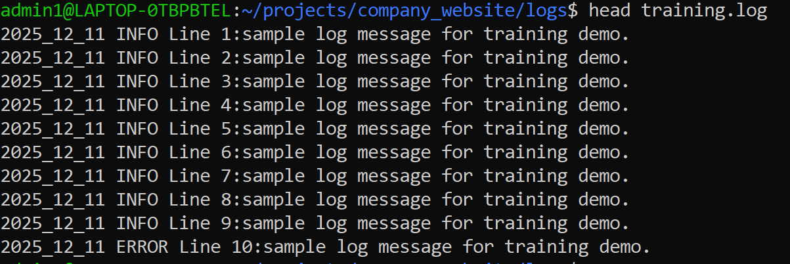

# Linux Commands Cheat Sheet (With Real-World Examples)

## 🧱 Level 1 – Knowing Where You Are & Seeing Files

### 1.1 `pwd` – Print Working Directory

**What it does:**  
Shows the full path of the directory you are currently in.

**Command:**
```bash
pwd
```

**Example (real world):**  
You’re inside a project and want to confirm the path:
```bash
admin1@LAPTOP:~$ pwd
/home/admin1/projects/company_website
```

---

### 1.2 `ls` – List Files

**What it does:**  
Lists files and folders.

**Basic:**
```bash
ls
```

**With details (`-l`) & hidden files (`-a`):**
```bash
ls -la
```

**Real-world example:**  
List log files inside a `logs` folder:
```bash
ls logs
# Output:
# app.log  error.log  system_2025_12_11.log
```

---

### 1.3 `cd` – Change Directory

**What it does:**  
Moves you between folders.

**Commands:**
```bash
cd /home/admin1/projects/company_website   # Go to project folder
cd logs                                     # Go inside logs
cd ..                                       # Go one level up
cd                                          # Go to home folder
```

**Real-world example:**  
Navigate into your website project:
```bash
cd ~/projects/company_website
```

---
## How to create a file with min 50 lines
```bash
admin1@LAPTOP-0TBPBTEL:~/projects/company_website/logs$ for i in $(seq 1 50); do
> if((i%10==0)); then
> level="ERROR"
> else
> level="INFO"
> fi
> echo "2025_12_11 $level Line $i:sample log message for training demo." >>training.log
> done
```
What this does:

- seq 1 50 → numbers from 1 to 50
- Every 10th line becomes ERROR, others are INFO
- Appends lines to training.log like:
   - 2025-12-11 INFO Line 1: Sample log message...
   - 2025-12-11 ERROR Line 10: Sample log message...
   - ... up to line 50.
## Check the file exists and line count:
```bash
ls
wc -l training.log

```


## 2️⃣ Practice with head

```bash 
head training.log

```

### First 5 lines:
`head -n 5 training.log`

### First 20 lines:
`head -n 20 training.log`

## 3️⃣ Practice with tail
### See the last 10 lines (default):
`tail training.log`

#### Last 5 lines:
`tail -n 5 training.log`

### Last 15 lines:
`tail -n 15 training.log`

### 4️⃣ See lines from the middle of the file

#### Example: show lines 21–30 using a head + tail combo:

`head -n 30 training.log | tail -n 10`
### Explanation:
- head -n 30 → first 30 lines
- tail -n 10 → from those, show the last 10 (i.e., 21–30)

---

### 5️⃣ Use less to scroll
`less training.log`

Controls inside less:
- Arrow keys / PgUp / PgDn → move
- q → quit
---

## 6️⃣ Use grep with your 50 lines
### Show only ERROR lines:
`grep "ERROR" training.log`

### Show only INFO lines:
`grep "INFO" training.log`

### Show last 20 lines, but only ERRORs:
`tail -n 20 training.log | grep "ERROR"`

---
## 7️⃣ Some more useful commands on this file
### Count how many ERROR lines:
`grep -c "ERROR" training.log`

### Count how many INFO lines:
`grep -c "INFO" training.log`

### Show line numbers with content:
`nl -ba training.log | head -n 10`

(nl -ba = “number lines, including blank ones”)

---

## 📄 Level 2 – Viewing File Content

### 2.1 `cat` – View Whole File (Quick)

**What it does:**  
Prints the entire file content to the screen.

```bash
cat logs/error.log
```

**Real-world use:**  
Quickly inspect a small error log.

---

### 2.2 `less` – Scroll Through a File

**What it does:**  
Opens file in a scrollable viewer.

```bash
less logs/system_2025_12_11.log
```

- Use ↑ / ↓ or PageUp / PageDown to scroll  
- Press `q` to quit

**Real-world use:**  
View a long log file without flooding the terminal.

---

### 2.3 `head` and `tail` – Start & End of File

**What they do:**

- `head` → shows the **first** 10 lines  
- `tail` → shows the **last** 10 lines  

```bash
head logs/app.log
tail logs/app.log
```

**With `-n` specify number of lines:**

```bash
tail -n 20 logs/error.log   # Last 20 lines
```

**Real-world use:**  
See the **latest log messages**:
```bash
tail -n 30 logs/system_2025_12_11.log
```

---

## 🔍 Level 3 – Searching Inside Files (`grep`)

### 3.1 `grep` – Search for Text

**What it does:**  
Searches for lines containing a pattern.

```bash
grep "ERROR" logs/*.log
```

**Real-world use:**  
Find all errors in log files:
```bash
grep -i "error" logs/*.log
```

- `-i` → case-insensitive  
- `*.log` → all `.log` files

---

### 3.2 `grep` with `tail` – Monitoring Logs

**Real-world scenario:**  
Web app is running; you want to watch errors live.

```bash
tail -f logs/app.log | grep -i "error"
```

- `tail -f` → follow file as it grows (live)
- `| grep -i "error"` → only show lines with "error"

Press `Ctrl + C` to stop.

---

## 📂 Level 4 – Working with Directories & Files

### 4.1 `mkdir` – Make Directory

```bash
mkdir backups
```

**Real-world example:**  
Create folder for log backups:
```bash
mkdir -p backups/logs
```
- `-p` → create parent directories if needed

---

### 4.2 `cp` – Copy Files

```bash
cp logs/error.log backups/error_backup.log
```

**Real-world use:**  
Copy today’s logs before modifying:
```bash
cp logs/system_2025_12_11.log backups/system_2025_12_11_copy.log
```

---

### 4.3 `mv` – Move / Rename Files

```bash
mv logs/app.log logs/app_old.log      # rename
mv logs/*.log backups/                # move all logs to backups
```

---

### 4.4 `rm` – Remove Files

⚠️ **Dangerous – deletes permanently**

```bash
rm logs/app.log
rm -r old_logs/        # delete directory and its contents
```

**Real-world use:**  
Clean old backup folder:
```bash
rm -r backups/old_2024_logs
```

---

## 📦 Level 5 – Compression & Backups (`tar`, `gzip`)

### 5.1 `tar` – Create a Compressed Backup (`.tar.gz`)

**Command:**

```bash
tar -czvf backups/logs_backup_2025_12_11.tar.gz logs
```

**Meaning:**

- `-c` → create archive  
- `-z` → compress with gzip  
- `-v` → verbose (show files)  
- `-f` → output to file  

**Real-world operation:**  
Take a backup of all log files so you can send or store safely.

Result:
```text
backups/logs_backup_2025_12_11.tar.gz
```

---

### 5.2 `tar` – List Files Inside a `.tar.gz`

```bash
tar -tzvf backups/logs_backup_2025_12_11.tar.gz
```

**Operation:**

- `-t` → list contents (do not extract)

**Real-world use:**  
Check what’s inside a backup archive before extracting.

---

### 5.3 `tar` – View Single File from `.tar.gz` (No Extract)

```bash
tar -xzOf backups/logs_backup_2025_12_11.tar.gz logs/error.log
```

**Options:**

- `-x` → extract  
- `-z` → use gzip  
- `-O` (capital O) → write file content to screen  
- `-f` → archive file  

**Real-world use:**  
View a past `error.log` from a backup without unpacking everything.

With paging:

```bash
tar -xzOf backups/logs_backup_2025_12_11.tar.gz logs/error.log | less
```

---

### 5.4 `tar` – Extract the Entire Backup

```bash
tar -xzvf backups/logs_backup_2025_12_11.tar.gz
```

**Real-world use:**  
Restore the `logs/` folder from backup.

To extract into a specific directory:

```bash
mkdir -p restore_logs
tar -xzvf backups/logs_backup_2025_12_11.tar.gz -C restore_logs
```

---

## ⚙️ Level 6 – Permissions & Ownership (Basics)

### 6.1 `chmod` – Change Permissions

```bash
chmod 644 logs/app.log
```

- `644` → owner read/write, others read-only  

**Real-world use:**  
Ensure log files are not editable by everyone.

Make a script executable:
```bash
chmod +x deploy.sh
```

---

### 6.2 `chown` – Change Owner (Requires `sudo` in many cases)

```bash
sudo chown admin1:admin1 logs/app.log
```

**Real-world use:**  
If a file is created as `root`, you can reclaim it as your user.

---

## 🧠 Level 7 – Processes & System Info

### 7.1 `ps` – Show Running Processes

```bash
ps aux | grep python
```

**Real-world example:**  
Find if your Python web server is running.

---

### 7.2 `top` or `htop` – Live System Monitor

```bash
top
```

**Real-world example:**  
Check which process is using high CPU or memory.

Press `q` to exit.

---

### 7.3 `kill` – Stop a Process

1. Find the process ID (PID):

```bash
ps aux | grep "gunicorn"
```

2. Kill it:

```bash
kill 12345        # normal kill
kill -9 12345     # force kill
```

---

## 🔗 Level 8 – Pipes & Redirection (Super Power Combo)

### 8.1 Pipe (`|`) – Send Output of One Command into Another

**Example:**

```bash
tail -n 100 logs/system_2025_12_11.log | grep -i "error"
```

**Operation (real world):**

- Get last 100 lines of system log  
- From those, only show lines containing "error"

---

### 8.2 Redirect Output to a File (`>` and `>>`)

```bash
ls logs > logs_list.txt        # overwrite file with output
ls logs >> logs_list.txt       # append to file
```

**Real-world use:**  
Save list of log files for documentation:
```bash
ls logs > backups/logs_inventory_2025_12_11.txt
```

---

## 🌱 Suggested Learning Flow (How to Practice Incrementally)

1. **Start with navigation & listing**  
   - `pwd`, `ls`, `cd`
2. **View and explore files**  
   - `cat`, `head`, `tail`, `less`
3. **Search inside files**  
   - `grep`, `tail -f ... | grep`
4. **Work with backup directories**  
   - `mkdir`, `cp`, `mv`, `rm`
5. **Create and manage backups**  
   - `tar -czvf`, `tar -tzvf`, `tar -xzvf`, `tar -xzOf`
6. **Monitor system and processes**  
   - `ps`, `top`, `kill`
7. **Combine commands** using pipes & redirects  
   - `|`, `>`, `>>`

Practice these on your `company_website` project and `logs` folder like you already did:
- Search errors in logs  
- Backup logs to `.tar.gz`  
- Restore and inspect backups  

This will make you very comfortable with real-world Linux usage.
