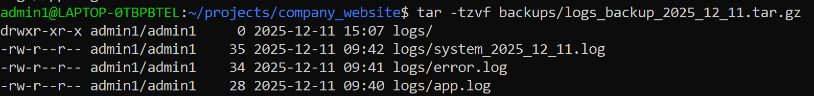

# Practical WSL Labs on Windows (Step-by-Step)

This document contains **real-world mini projects** you can perform using **WSL (Ubuntu on Windows)**.  
Each scenario is mapped to your Linux syllabus topics: basic commands, file management, permissions, pipes/filters, processes, and network utilities.

---

## 0. One-Time WSL Setup on Windows

1. Open **PowerShell as Administrator**.
2. Run:
   ```powershell
   wsl --install -d Ubuntu
   ```
3. Restart when asked.
4. After reboot, open **“Ubuntu”** from the Start Menu.
5. Create a **Linux username & password** (inside WSL; separate from Windows).

From now on, whenever you see **“open WSL terminal”**, just open the Ubuntu app.

---

## Scenario 1: Create a “Dev Workspace” for Your Projects  

**Covers:** Basic Linux commands, Directory management  

**Goal:** Organize your Linux home directory like a real developer.

1. Open WSL (Ubuntu).
2. Check where you are:
   ```bash
   pwd
   ```
3. List files:
   ```bash
   ls
   ```
4. Create main folders for your work:
   ```bash
   mkdir -p ~/projects/python
   mkdir -p ~/projects/devops
   mkdir -p ~/projects/data
   ```
5. Move into the Python folder:
   ```bash
   cd ~/projects/python
   pwd
   ```
6. Create a simple notes file:
   ```bash
   echo "Python practice notes" > notes.txt
   ls
   cat notes.txt
   ```

> **Real world:** Developers keep code organized in folders under `~/projects`. You’ll keep all future labs inside this directory.

---

## Scenario 2: File & Directory Management Like a Sysadmin  

**Covers:** File management, Directory management, Basic utilities  

**Goal:** Simulate a small project folder, copy/move files, search, and compress them.

1. In WSL:
   ```bash
   cd ~/projects
   mkdir -p company_website/{logs,scripts,configs,backups}
   cd company_website
   ```
2. Create some sample log files:
   ```bash
   echo "2025-12-11 INFO App started" > logs/app.log
   echo "2025-12-11 ERROR Something failed" > logs/error.log
   echo "2025-12-11 WARN Disk usage high" > logs/system.log
   ```
3. View them:
   ```bash
   ls logs
   cat logs/error.log
   ```
4. Copy a configuration template:
   ```bash
   echo "PORT=8080" > configs/app.conf
   cp configs/app.conf configs/app.conf.bak
   ls configs
   ```
5. Move & rename a file:
   ```bash
   mv logs/system.log logs/system_2025_12_11.log
   ```
## What is `grep`?

`grep` stands for **G**lobal **R**egular **E**xpression **P**rint.

In simple words:

> `grep` searches for a **text pattern** inside files and **prints only the lines that match**.
Why is grep not showing anything?

If grep finds no matching lines, it prints nothing and just returns to the prompt.
That’s normal behavior.

Possible reasons:

### 1. No matching text

There may be no lines in the log files that contain "ERROR" or "error" exactly.

### 2. Case sensitivity

**grep** is **case-sensitive** by default:

**"ERROR"** is different from `"Error"` and `"error"`.

If your log has:

Error: something failed


then:
```bash
grep "ERROR" logs/*.log    # No match
grep "error" logs/*.log    # No match
grep -i "error" logs/*.log # ✅ Matches Error / ERROR / error
``

### Use -i for case-insensitive search:

`grep -i "error" logs/*.log`

Example:

```bash
grep "hello" myfile.txt

6. Find all files with “ERROR” inside logs:
   ```bash
   grep "ERROR" logs/*.log
   ```
### 7. Compress all logs for backup:


   ```bash
   tar -czvf backups/logs_backup_2025_12_11.tar.gz logs
   ls backups
   ```
### 5.1 What is `tar`?

`tar` = **tape archive**  

It’s a tool to **bundle many files/folders into a single archive file**  
(often called a **tarball**).

---

### 5.2 Meaning of options: `-czvf`

The flags:

- `-c` → **create** a new archive  
- `-z` → **compress with gzip** (makes the file smaller, ends with `.tar.gz`)  
- `-v` → **verbose** (shows each file being added – prints names on screen)  
- `-f` → **file** (the next argument is the archive filename)

So `-czvf` together means:

> **Create a new gzip-compressed archive, show progress, and write it to the file I give next.**

---

### 5.3 The output file: `backups/logs_backup_2025_12_11.tar.gz`

This is the **name and location** of the archive:

- `backups/` → store the archive in the `backups` directory  
- `logs_backup_2025_12_11.tar.gz` → the filename  
  - `logs_backup` → your chosen name  
  - `2025_12_11` → date (good practice for backups)  
  - `.tar.gz` → a tar archive compressed with gzip  

So this command will create:

```text
backups/logs_backup_2025_12_11.tar.gz
```

### how to unzip or view the files in tar.gz

 `ls backups`
 

 `cat backups/logs_backup_2025_12_11.tar.gz`

 ### 1️⃣ List what’s inside the .tar.gz
 ` tar -tzf backups/logs_backup_2025_12_11.tar.gz`
 

` tar -tzvf backups/logs_backup_2025_12_11.tar.gz`



> **Real world:** On production servers, logs are rotated, compressed, and stored in backup folders exactly like this.

---

## Scenario 3: Permissions & Access Modes – Create a Secure Folder  

**Covers:** File permissions / Access modes  

**Goal:** Create a private folder that only **you** can read/write.

1. Go to your projects:
   ```bash
   cd ~/projects
   mkdir secrets
   cd secrets
   ```
2. Create a file with “sensitive” data:
   ```bash
   echo "DB_PASSWORD=SuperSecret123" > db_credentials.txt
   ls -l
   ```
3. Check current permissions:
   ```bash
   ls -l db_credentials.txt
   # Note the rw-r--r-- pattern
   ```
4. Remove **group** and **others** permissions:
   ```bash
   chmod go-rwx db_credentials.txt
   ls -l db_credentials.txt
   # Now it should show: rw-------
   ```
5. Make the whole folder private:
   ```bash
   cd ..
   chmod 700 secrets
   ls -ld secrets
   ```

> **Real world:** Admins protect config and credential files (SSH keys, DB passwords, API keys) using these permission settings.

---

## Scenario 4: Pipes & Filters on a CSV “Business Report”  

**Covers:** Pipes and filters, Basic utilities  

**Goal:** Analyze a fake sales report using **only commands**, no Excel.

1. Create a sample CSV:
   ```bash
   cd ~/projects
   mkdir reports && cd reports

   cat > sales.csv <<EOF
   id,customer,city,amount
   1,Ravi,Chennai,1200
   2,Ananya,Bangalore,2500
   3,Vikram,Chennai,1800
   4,Meera,Hyderabad,900
   5,Ravi,Chennai,700
   EOF
   ```
2. View file:
   ```bash
   cat sales.csv
   ```
3. See only Chennai customers:
   ```bash
   grep "Chennai" sales.csv
   ```
4. Sort by amount (numeric):
   ```bash
   cat sales.csv | sort -t',' -k4 -n
   ```
5. Show just customer and amount (using `cut`):
   ```bash
   tail -n +2 sales.csv | cut -d',' -f2,4
   ```
6. Sum total sales using `awk`:
   ```bash
   tail -n +2 sales.csv | awk -F',' '{sum += $4} END {print "Total:", sum}'
   ```

> **Real world:** Data engineers and support engineers use command-line pipes daily to quickly analyze logs, CSVs, and stats on servers.

---

## Scenario 5: Run a Simple Python Web App in WSL & Open It in Windows  

**Covers:** Basic utilities, Process management, Network utilities  

**Goal:** Run a small web server in WSL and open it from your Windows browser.

1. Install Python (if not already):
   ```bash
   sudo apt update
   sudo apt install -y python3 python3-pip
   ```
2. Create a folder & app:
   ```bash
   cd ~/projects/python
   mkdir hello_web && cd hello_web
   ```
3. Create `app.py`:
   ```bash
   cat > app.py <<EOF
   from http.server import SimpleHTTPRequestHandler, HTTPServer

   PORT = 8000

   class Handler(SimpleHTTPRequestHandler):
       def do_GET(self):
           self.send_response(200)
           self.send_header("Content-type", "text/html")
           self.end_headers()
           message = "<h1>Hello from WSL on Windows!</h1>"
           self.wfile.write(message.encode())

   if __name__ == "__main__":
       print(f"Server running on port {PORT}...")
       with HTTPServer(("", PORT), Handler) as httpd:
           httpd.serve_forever()
   EOF
   ```
4. Run the server:
   ```bash
   python3 app.py
   ```
   Leave this terminal running.
5. On **Windows**, open a browser and go to:  
   `http://localhost:8000`
6. You should see **“Hello from WSL on Windows!”** in the browser.
7. To stop the server, go back to WSL and press `Ctrl + C`.

> **Real world:** Backend developers run APIs/web servers in WSL while using Windows tools like VS Code, Postman, and Chrome.

---

## Scenario 6: Process Management – Find & Kill a Misbehaving Process  

**Covers:** Process management, Basic utilities  

**Goal:** See running processes, filter them, and kill one.

1. Start a long-running process (for demo):
   ```bash
   cd ~/projects
   yes "CPU Test" > /dev/null &
   ```
2. List all processes:
   ```bash
   ps aux | head
   ```
3. Filter for the `yes` process:
   ```bash
   ps aux | grep yes
   ```
   Note the **PID** (second column).
4. Kill the process:
   ```bash
   kill <PID>
   # Example: kill 1234
   ```
5. Confirm it’s gone:
   ```bash
   ps aux | grep yes
   ```

> **Real world:** On servers, you often have to stop runaway scripts or services consuming too much CPU/RAM.

---

## Scenario 7: Network Communication Utilities (Ping, Curl, nslookup)  

**Covers:** Network communication utilities  

**Goal:** Check connectivity and DNS like a support engineer.

1. Test internet connectivity:
   ```bash
   ping -c 4 google.com
   ```
2. See website headers (like a basic API check):
   ```bash
   curl -I https://www.microsoft.com
   ```
3. Look up DNS info for a site:
   ```bash
   sudo apt install -y dnsutils
   nslookup openai.com
   ```
4. Check open ports (install `net-tools`):
   ```bash
   sudo apt install -y net-tools
   netstat -tulnp | head
   ```

> **Real world:** SREs and DevOps engineers use these tools to debug “site not working” tickets.

---

## Scenario 8: Use Git on WSL While Editing Code in Windows VS Code  

**Covers:** Basic utilities, File management, Real development workflow  

**Goal:** Manage a Git repo in WSL, but edit files using Windows VS Code.

1. Install Git:
   ```bash
   sudo apt update
   sudo apt install -y git
   ```
2. Configure your identity:
   ```bash
   git config --global user.name "Your Name"
   git config --global user.email "you@example.com"
   ```
3. Create a repo:
   ```bash
   cd ~/projects
   mkdir demo_repo && cd demo_repo
   git init
   echo "# Demo Repo" > README.md
   git status
   ```
4. Add & commit:
   ```bash
   git add README.md
   git commit -m "Initial commit"
   ```
5. In **Windows**, open VS Code and use:  
   **File → Open Folder →** navigate to:  
   `\\wsl$\Ubuntu\home\<your-username>\projects\demo_repo`  

   This lets you edit Linux files directly from Windows VS Code.

> **Real world:** A very common setup: code runs in Linux (WSL), but you use Windows GUI tools for editing and testing.

---

## Mapping to Your Syllabus

- **Basic Linux commands / Directory Management** → Scenarios 1 & 2  
- **File Management** → Scenario 2 (logs, backups, compression)  
- **Unix Commands Deep Dive** → Scenario 4 (cut, sort, awk, grep)  
- **File Permissions / Access Modes** → Scenario 3  
- **Basic Utilities** → Across all scenarios (`ls`, `cat`, `echo`, `grep`, `tar`, `awk`, `ps`, `ping`, `curl`)  
- **Pipes & Filters** → Scenario 4 (`|` everywhere)  
- **Process Management** → Scenarios 5 & 6  
- **Network Communication Utilities** → Scenario 7  

You can directly share this `.md` file with students or import it into your tutorial site.
